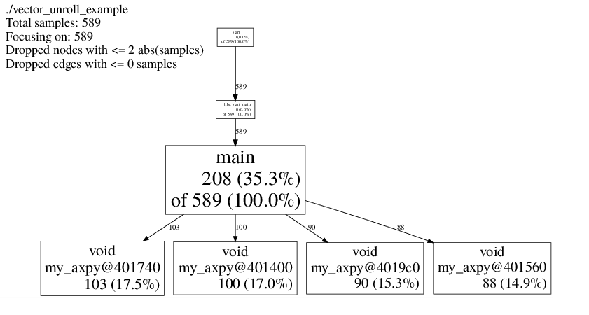
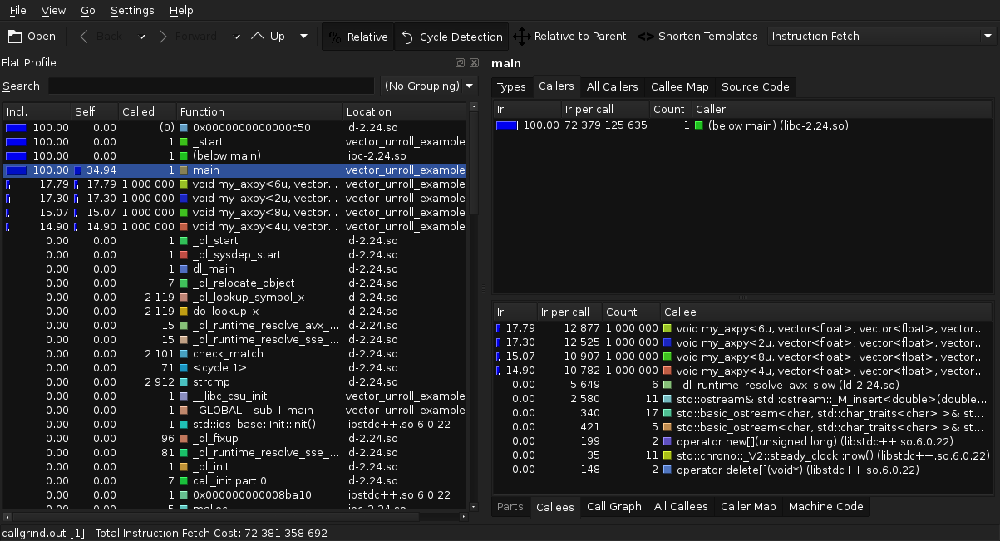
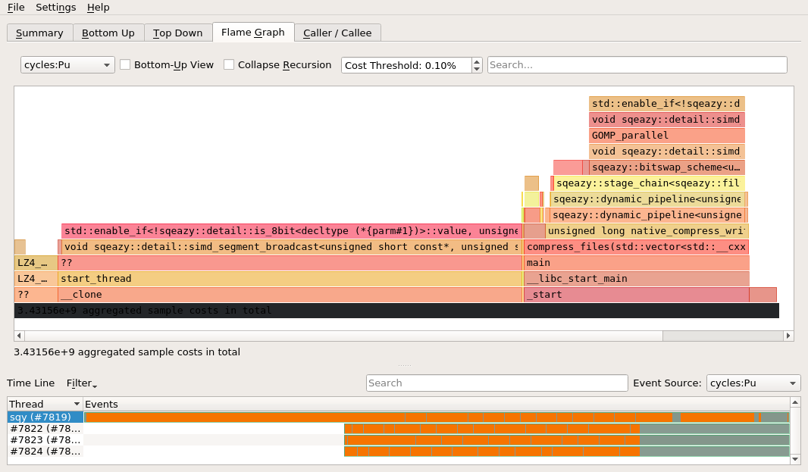
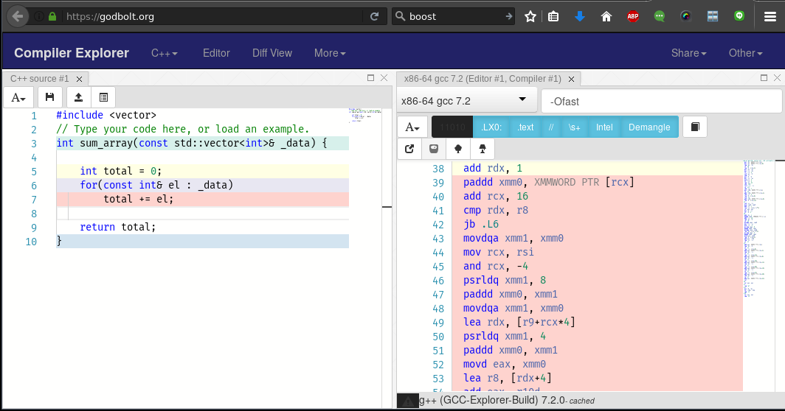
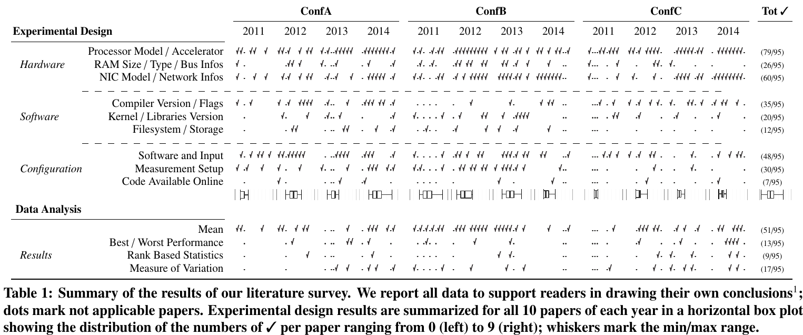
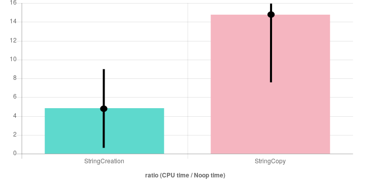
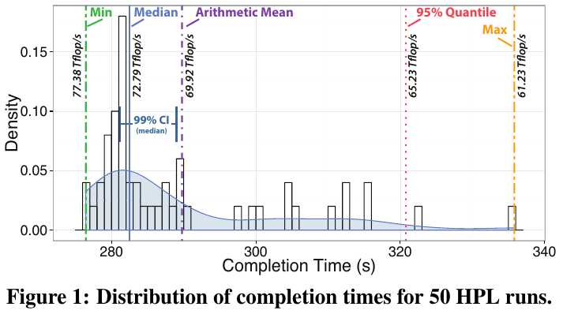

## Agenda 


1. `whoami` and Motivation
2. Performance outside-in
3. Performance inside-out
4. Benchmarks and how to create them


# whoami and Motivation


## Disclaimer


.container-fluid[

.row justify-content-center[

  .col[

{ class="figure-img img-fluid" width="40%" }  

**[github.com/psteinb/meetingcpp2017](https://github.com/psteinb/meetingcpp2017)**


  .]

.]

.]


:notes[

report bugs and questions there!

:]


## `whoami`

.container-fluid[

.row align-items-center[

.col[

{ class="figure-img img-fluid" width="50%" }

.]

.col[

**[Scionics Computer Innovation GmbH](www.scionics.de)**

- software and consulting company
- founded in 2001 in Dresden, Germany
- expertise in data analysis, bioinformatics, image analysis, HPC, ...

.]

.]

.]


:notes[

- 2h by car south of Berlin  
- NEXT: biggest client = CBG

:]


## Our Client


.container-fluid[

.row align-items-center[

.col[

{ class="figure-img img-fluid" width="100%" }

[mpi-cbg.de](www.mpi-cbg.de)

.]

.col[

- 500+ staff
- my role: *Scientific Software Engineer*
- support users on our HPC infrastructure
- software projects related to performance (think multi-threaded, GPUs, ..)

.]

.]

.]


:notes[

- biggest client
- NEXT: How does my day look like sometimes ...

:]


# Performance Outside-In


## One day as a Performance Engineer

, CC](img/flickr_ORourke_2_busy_to_improve_1200px.png){ class="figure-img img-fluid" width="70%" }

:notes[

- scientists typically develop algorithms (to publish)
- performance is important for usablity

:]

## Once in a while { data-background-image="img/frustration-cry-1682140_1920.jpg" }

.container[

.row align-items-center[

.col[

```
From: doe@theinstitute.de
Subject: Cluster is slow
Date: Fri, 20 Oct 2017 12:03:21 +0200
To: hpcsupport@theinstitute.de

Hi,

what is going on with the cluster? My application is running
slow since yesterday.
Could you have a look at it please?

Thanks,
John
```

.]

.]

.]


:notes[

- speed is a subjective measure
- performance is a matter of perspective
- note: description for reproducibility missing
- https://youtu.be/FnGCDLhaxKU?t=6152

:]


## Challenge: Finding the performance regression without looking at the code {  data-background-image="img/traffic_jam_800px.png" data-background-position="right" style="background: rgba(105,105,105, 0.8); border-radius: 20px;" }

:notes[

- find the street with the traffic jam
- experience guided

:]


## High Level Overview


.container-fluid[

.row align-items-center[

.col[

, [free](https://linux.die.net/man/1/free) et al](img/htop_in_action.png){ class="figure-img img-fluid" width="90%" }

.]

.col[

 courtesy of Fergie4000, CC-BY 3.0](img/Win7-tskman-perf.png){ class="figure-img img-fluid" width="80%" }

.]

.]

.]


## Reference Numbers

```
$ dd if=/dev/zero of=/tmp/just_zeros bs=1G count=2
2+0 records in
2+0 records out
2147483648 bytes (2.1 GB) copied, 2.94478 s, 729 MB/s

$ dd if=/dev/zero of=/dev/shm/2gb.zeros bs=1G count=2
2+0 records in
2+0 records out
2147483648 bytes (2.1 GB) copied, 1.14782 s, 1.9 GB/s
```

&nbsp;

**What can your hardware typically do?**  

`dd`, [ior](http://www.nersc.gov/users/computational-systems/cori/nersc-8-procurement/trinity-nersc-8-rfp/nersc-8-trinity-benchmarks/ior/), `memhog`,  [stream](https://www.cs.virginia.edu/stream/), ...


:notes[

- to search for the bottleneck, know your performance without it
- guesstimate the bottleneck, cross check expected performance with a benchmark

]


## Profile with [perf](https://perf.wiki.kernel.org/index.php/Main_Page)

.container-fluid[

.row align-items-center[

  .col-8[


```
$ perf record -g ./my-slow-binary
[ perf record: Woken up 1 times to write data ]
[ perf record: Captured and wrote 0.023 MB perf.data (75 samples) ]
$ perf report --stdio
no symbols found in /usr/bin/dd, maybe install a debug package?
# ...
# Total Lost Samples: 0
#
# Samples: 75  of event 'cycles:u'
# Event count (approx.): 1839654
#
# Children      Self  Command  Shared Object      Symbol           
# ........  ........  .......  .................  ................
#
    20.18%    20.18%  dd       [kernel.kallsyms]  [k] page_fault
            |          
             --19.77%--0
                       _int_realloc
                       page_fault
```

  .]

  .col-4[

  - instrument CPU performance counters, tracepoints and system probes
  - lightweight sample based profiling 
  - per task, per CPU and per-workload counters
  - on windows: [xperf](https://docs.microsoft.com/en-us/windows-hardware/test/wpt/wpt-getting-started-portal)
  
  .]

.]

.]


## [perf](https://perf.wiki.kernel.org/index.php/Main_Page) Reloaded with [FlameGraphs](https://github.com/brendangregg/FlameGraph)


.container-fluid[

.row align-items-center[

  .col-8[


```
$ perf record -g ./my-slow-binary
[ perf record: Woken up 1 times to write data ]
[ perf record: Captured and wrote 0.023 MB perf.data (75 samples) ]
$ perf script > out.perf
$ ./stackcollapse-perf.pl out.perf > out.folded
$ ./flamegraph.pl out.folded > perf_samples.svg
```

  .]

  .col-4[

  - visualisation technique conceived by [Brendan Gregg](https://github.com/brendangregg) (Netflix)
  - seemless integration into perf, dtrace, systemtap, XCode Instruments, Lightweight Java Profiler, Microsoft Visual Studio profiles, ...
  - based on collected perf samples and the stacktrace they were collected in
  
  .]

.]

.]


## Ethereum Mining [as FlameGraph](figure/flamegraph/ethminer-cuda-simulate.svg)

.container-fluid[

.row align-items-center[

  .col[
  
  <object type="image/svg+xml" data="figure/flamegraph/ethminer-cuda-simulate.svg" width="90%">
  Your browser does not support SVG
  </object>

  .]

.]

.]


.container-fluid[

.row align-items-start[

  .col[

  - (x axis) current stack level in alphabetical order  
  
  .]

  .col[
  
  - (y axis) number of samples in that stacktrace level

  .]

.]

.]

:notes[

- alphetical ordering inside each stacktrace level

:]


## HPC user's slow application

.container-fluid[

.row align-items-center[

  .col[
  
  <object type="image/svg+xml" data="figure/flamegraph/hpc_user.svg" width="90%">
  Your browser does not support SVG
  </object>

  .]

.]

.]


:notes[

- performance profile shows i/o spinning wildly
- storage hardware was malfunctioning
- this graph = cpu_cycles; alternative = i/o flamegraph

- **so far**: didn't touch the source code or build it

:]

## Bottom Line { data-background-image="img/balloon.jpeg" style="background: rgba(105,105,105, 0.8); border-radius: 20px;"}

Taking a balloon to get an overview of performance bottlenecks is possible.


# Performance Inside-Out {  data-background-image="img/cable_chaos.jpg" style="background: rgba(105,105,105, 0.8); border-radius: 20px;" }


## High Diversity of Tools! { data-background-image="img/dreamstime-in-c++.jpg" data-background-position="right" style="background: rgba(105,105,105, 0.8); border-radius: 20px;"}

:notes[

- tricky to recommend one only
- tricky to find cross platform one
- typical: develop/profile on one platform, choose deploy on all
- now: brief tour

:]

## Textual output, `gprof`

```
Flat profile:

Each sample counts as 0.01 seconds.
  %   cumulative   self              self     total           
 time   seconds   seconds    calls  Ts/call  Ts/call  name    
 26.71      1.02     1.02                             void my_axpy<6u, vector<float>, vector<float>, vector<float> >(vector<float>&, vector<float> const&, vector<float> const&)
 26.71      2.05     1.02                             void my_axpy<2u, vector<float>, vector<float>, vector<float> >(vector<float>&, vector<float> const&, vector<float> const&)
 23.83      2.96     0.91                             void my_axpy<8u, vector<float>, vector<float>, vector<float> >(vector<float>&, vector<float> const&, vector<float> const&)
 23.04      3.84     0.88                             void my_axpy<4u, vector<float>, vector<float>, vector<float> >(vector<float>&, vector<float> const&, vector<float> const&)
  0.00      3.84     0.00        1     0.00     0.00  _GLOBAL__sub_I_main
```

Profile from [Peter Gottschling's example on vector unrolling](https://github.com/petergottschling/discovering_modern_cpp/blob/master/c%2B%2B11/vector_unroll_example.cpp).


## Simple Graphical output, `perftools`

.container-fluid[

.row align-items-center[

  .col[
  
  <!-- <object type="image/svg+xml" data="figure/profiling/perftools/pprof21143.0.svg" width="90%"> -->
  <!-- Your browser does not support SVG -->
  <!-- </object> -->
  
  { class="figure-img img-fluid" width="90%" }  
  
  .]

.]

.]

Profile from [Peter Gottschling's example on vector unrolling](https://github.com/petergottschling/discovering_modern_cpp/blob/master/c%2B%2B11/vector_unroll_example.cpp).


## Using a pseudo-VM, `kcachegrind/valgrind`

.container-fluid[

.row align-items-center[

  .col[
  
  { class="figure-img img-fluid" width="80%" }  
  
  .]

.]

.]

Profile from [Peter Gottschling's example on vector unrolling](https://github.com/petergottschling/discovering_modern_cpp/blob/master/c%2B%2B11/vector_unroll_example.cpp).


:notes[

- pseudo-vm is the only way to obtain a line profile in C++

:]


## Using flamegraphs, `hotspot`

.container-fluid[

.row align-items-center[

  .col[
  
  { class="figure-img img-fluid" width="80%" }  
  
  .]

.]

.]


:notes[

- thanks to KDAB
- well done tool with bright future

:]


## Proprietary tools

... some nice images ...


:notes[

- NEXT: hotspot found

:]


## Found a hot spot! { data-background-image="img/1024px_light-bulb-light-old.jpg" data-background-position="right" }


:notes[

- search finished, critical function/class identified
- NOW: find out why it is slow?

:]


## Danger zone of mental models { data-background-image="img/slip-up-danger-careless-slippery.jpg" data-background-position="right" style="background: rgba(105,105,105, 0.8); border-radius: 20px;" }

:notes[

- mental models are often wrong or outdated
- with a colleaque or rubber duck, come up with falsifyable hypothesis!

:]


## Inspect Assembly?

.container-fluid[

.row align-items-center[

  .col[
  
  { class="figure-img img-fluid" width="100%" }  
  
  .]

.]

.]


:notes[

- inspecting assembly tough!
- play with -O flags to get a feeling
- mental hardware model can still be wrong
- asm can only partially falsify hypothesis

:]


## perf for hardware exploration?


&nbsp;


.container-fluid[

.row align-items-center[

.col-8[

```
$ perf list

List of pre-defined events (to be used in -e):

  branch-instructions OR branches                    [Hardware event]
  branch-misses                                      [Hardware event]
  bus-cycles                                         [Hardware event]
  cache-misses                                       [Hardware event]
  cache-references                                   [Hardware event]
  cpu-cycles OR cycles                               [Hardware event]
  instructions                                       [Hardware event]
  ref-cycles                                         [Hardware event]
  stalled-cycles-frontend OR idle-cycles-frontend    [Hardware event]
  #...
  L1-dcache-load-misses                              [Hardware cache event]
  L1-dcache-loads                                    [Hardware cache event]
  L1-dcache-prefetch-misses                          [Hardware cache event]
  L1-dcache-store-misses                             [Hardware cache event]
  L1-dcache-stores                                   [Hardware cache event]
  L1-icache-load-misses                              [Hardware cache event]
  #...
```

.]

.col-4[


- perf event list depends on kernel version
- hardware counters are not portable (specification change by vendors)
- alternative: [ocperf](https://github.com/andikleen/pmu-tools)


.]

.]

.]


## Test hypothesis with [likwid](https://github.com/RRZE-HPC/likwid)

.container-fluid[

.row align-items-center[

  .col[
  
  ](img/likwid-repo.png){ class="figure-img img-fluid" width="100%" }
  
  .]

.]

.]

.container-fluid[

.row align-items-start[

.col[

- open source Performance monitoring and benchmarking suite
- Linux only

.]

.col[

- profiling through hardware counters (consistent meta markers for portability)
- exploration through monitoring
- marker API for C, C++, java and python

.]

.]

.]


## use case: Index Lists

.container-fluid[

.row align-items-center[

.col[


```
#include <vector>
#include "omp.h"

struct item 
{
    std::vector<float> position, momentum;
    std::vector<int>   nearest_neighbors;
}

int main(int argc, char** argv){

    std::vector<item> world = generate(argc*10e6);
    
    for(int& time_step : timelapse){
        
        update(world);
        
        #pragma omp parallel for
        for(item& it : world){
            
            for(int& index : it.nearest_neighbors){
            
                auto distance = calculate(it, world[index]);
                if(distance > threshold)
                    it.nearest_neighbors.remove(index);
                
            }
        }
    }
    //store results
}
```

.]

.col[

- code has a lot of problems related to memory layout
- index of nearest neighbor `item` stored in vector
- **hypotheses**:  

    + large 'unpredictable' jumps in memory access deminishes cache bandwidth
    
    + [false sharing](https://en.wikipedia.org/wiki/False_sharing) forces cache line reloads as read-only and writable items may share the same cache line

. . . 


Let's measure!


.]

.]

.]


:notes[

- only show measurement for false sharing for brevity

:]

## use case: Through Likwid

.container-fluid[

.row align-items-start[

.col-6[

Use Case

```
# export OMP_NUM_THREADS=1
# path/to/likwid-perfctr -f -c 0 -g FALSE_SHARE numactl \
-m0 -C0 ./my_app
+----------------------------------|--------------+
|              Metric              |    Core 0    |
+----------------------------------|--------------+
|        Runtime (RDTSC) [s]       |      11.2125 |
|       Runtime unhalted [s]       |      17.7696 |
|            Clock [MHz]           |    3536.3990 |
|                CPI               |       0.4700 |
|  Local LLC false sharing [MByte] |       0.0008 |
|   Local LLC false sharing rate   | 5.608215e-10 |
| Remote LLC false sharing [MByte] |       0.0001 |
|   Remote LLC false sharing rate  | 8.628023e-11 |
+----------------------------------|--------------+

# export OMP_NUM_THREADS=4
# path/to/likwid-perfctr -f -c 0-4 -g FALSE_SHARE numactl \
-m0 -C0-3 ./my_app
+---------------------------------------|--------------|
|                 Metric                |      Sum     |
+---------------------------------------|--------------|
|        Runtime (RDTSC) [s] STAT       |      32.5048 |
|       Runtime unhalted [s] STAT       |      31.8024 |
|            Clock [MHz] STAT           |    9484.2143 |
|                CPI STAT               |       3.2922 |
|  Local LLC false sharing [MByte] STAT |    2973.7637 |
|   Local LLC false sharing rate STAT   |       0.0081 |
| Remote LLC false sharing [MByte] STAT |       0.0007 |
|   Remote LLC false sharing rate STAT  | 1.781667e-09 |
+---------------------------------------|--------------|
```

.]


.col-6[

Stream Benchmark as Reference

```
# export OMP_NUM_THREADS=1
# path/to/likwid-perfctr -f -c 0 -g FALSE_SHARE numactl \
-m0 -C0 ./stream
+----------------------------------|--------------+
|              Metric              |    Core 0    |
+----------------------------------|--------------+
|        Runtime (RDTSC) [s]       |      15.3517 |
|       Runtime unhalted [s]       |      24.1526 |
|            Clock [MHz]           |    3580.4732 |
|                CPI               |       1.0501 |
|  Local LLC false sharing [MByte] |       0.0006 |
|   Local LLC false sharing rate   | 6.057282e-10 |
| Remote LLC false sharing [MByte] |       0.0006 |
|   Remote LLC false sharing rate  | 6.057282e-10 |
+----------------------------------|--------------+

# export OMP_NUM_THREADS=4
# path/to/likwid-perfctr -f -c 0-4 -g FALSE_SHARE numactl \
-m0 -C0-3 ./stream
+---------------------------------------|--------------|
|                 Metric                |      Sum     |
+---------------------------------------|--------------|
|        Runtime (RDTSC) [s] STAT       |      19.1140 |
|       Runtime unhalted [s] STAT       |      25.9206 |
|            Clock [MHz] STAT           |   12688.3579 |
|                CPI STAT               |       4.5057 |
|  Local LLC false sharing [MByte] STAT |       0.1067 |
|   Local LLC false sharing rate STAT   | 4.080027e-07 |
| Remote LLC false sharing [MByte] STAT |       0.0012 |
|   Remote LLC false sharing rate STAT  | 4.438572e-09 |
+---------------------------------------|--------------|
```

.]

.]

.]


## Bottom Line

.container-fluid[

.row align-items-center[

.col[

- excellent tools available to find hot spots
- once "found", talk to someone  
(rubber duck or colleaque(s))
- create falsifyable hypothesis
- MEASURE!


.]


.col[

](img/rubber_duck_with_glasses.jpg){ class="figure-img img-fluid" width="100%" }

.]

.]

.]


:notes[

- NEXT: let's find alternative code paths (algorithms/technology)

:]


# Benchmarks and how to create them { data-background-image="img/dark_Odysseus_Journey_500less_1200px.png" style="margin-top: -200px; background: rgba(1,21,26, 0.8); border-radius: 20px;" }

## faster code?

[Chandler Carruth, Understanding Compiler Optimization, MeetingCPP 2015](https://youtu.be/FnGCDLhaxKU?t=6143)

> Klaus Iglberger: Guys that do know a lot about performance, do a lot of manual unrolling (manual vectorization). Apparently they don't trust the compiler too much. What is your take on this?

> Chandler: How do you define "poeple who know a lot about performance"? Serious question. So I work with Google's optimisation team who is responsible for making our C++ code run fast. And I have never seen them manually unroll a loop. 


## chrono is your friend

```
#include <chrono>
#include <iostream>
#include "production_code.hpp"
#include "new_ideas.hpp"

int main(int argc, char** argv){

    auto start = std::chrono::high_resolution_clock::now();
    auto result = production_code::algorithm();
    auto end = std::chrono::high_resolution_clock::now();
    std::chrono::duration<double> t_p = (end - start);
    
    start = std::chrono::high_resolution_clock::now();
    auto new_result = new_ideas::algorithm();
    end = std::chrono::high_resolution_clock::now();
    std::chrono::duration<double> t_i = (end - start);

    std::cout << "we achieved a speed-up of " << t_p.count()/t_i.count() 
              << std::endl;
}
```

## ... check for correctness

```
#include <chrono>
#include <iostream>
#include "production_code.hpp"
#include "new_ideas.hpp"

int main(int argc, char** argv){

    auto start = std::chrono::high_resolution_clock::now();
    auto result = production_code::algorithm();
    auto end = std::chrono::high_resolution_clock::now();
    std::chrono::duration<double> t_p = (end - start);
    
    start = std::chrono::high_resolution_clock::now();
    auto new_result = new_ideas::algorithm();
    end = std::chrono::high_resolution_clock::now();
    std::chrono::duration<double> t_i = (end - start);

    if(result == new_result)
        std::cout << "we achieved a speed-up of " << t_p.count()/t_i.count() 
                  << std::endl;
    else
        std::cout << "Never mind!" << std::endl;
}
```

## noisy lab under your fingers


```
#include <chrono>
#include <iostream>
#include "production_code.hpp"
#include "new_ideas.hpp"

int main(int argc, char** argv){

    auto result = 0;
    auto new_result = 0;
    
    auto start = std::chrono::high_resolution_clock::now();

    for(int i = 0;i<n_repititions;++i)
        result = production_code::algorithm();
   
    auto end = std::chrono::high_resolution_clock::now();
    std::chrono::duration<double> t_p = (end - start);
    
    start = std::chrono::high_resolution_clock::now();
    
    for(int i = 0;i<n_repititions;++i)
        new_result = new_ideas::algorithm();
        
    end = std::chrono::high_resolution_clock::now();
    std::chrono::duration<double> t_i = (end - start);

    if(result == new_result)
        std::cout << "we achieved a speed-up of " << t_p.count()/t_i.count() 
                  << std::endl;
    else
        std::cout << "Never mind!" << std::endl;
}
```

## Please take notes

```
#include <chrono>
#include <iostream>
#include <ifstream>
#include "production_code.hpp"
#include "new_ideas.hpp"

using duration_t = std::chrono::duration<double>;

int main(int argc, char** argv){
    //..
    auto start = std::chrono::high_resolution_clock::now();
    auto end = start;
    std::vector<duration_t> my_timings(n_repititions);

    for(int i = 0;i<n_repititions;++i){
        start = std::chrono::high_resolution_clock::now();
        result = production_code::algorithm();
        my_timings[i] = std::chrono::high_resolution_clock::now() - start;
    }
   
    //same with new_idea

    if(result == new_result){
        std::ofstream ofile("results.csv");ofile.open();
        for(int i = 0;i<n_repititions;++i){
            ofile << i << ",production," << prod_timings[i].count() << ",seconds" << std::endl;
        }
        //same with new_idea
        ofile.close()
    }
    else
        std::cout << "Never mind!" << std::endl;
}
```

## Why?

> ... It's a simple Python interface around a blazing fast C++ library ...

[from github.com/vincentlaucsb/csvmorph](https://github.com/vincentlaucsb/csvmorph)

&nbsp;

> ... However C++ code used to be significantly faster for a long time, and also today still is in many cases.

[from SO "How much faster is C++ than C#?"](https://stackoverflow.com/a/138406)

**[see more for youself!](http://lmgtfy.com/?q=C%2B%2B+faster)**

:notes[

- people expect C++ to be faster!!

:]

## Life as a reviewer


.container-fluid[

.row align-items-center[

.col[

{ class="figure-img img-fluid" width="100%" }

T. Hoefler et al, ["Scientific Benchmarking of Parallel Computing Systems - Twelve ways to tell the masses when reporting performance results"](https://dl.acm.org/citation.cfm?id=2807644), <br>SC '15 Proceedings, 2015


.]

.]

.]


:notes[

- reviewer for conference proceedings related to GPU programming
- very often: results are not reproducible and not based on ensemble's mean+variance

:]


## Let's take a toy example

.container-fluid[

.row align-items-center[

.col[

](img/quick_bench_example.png){ class="figure-img img-fluid" width="100%" }

.]

.]

.]

:notes[

- great tool!!
- use results with a grain of salt

:]

## ... what if

.container-fluid[

.row align-items-center[

.col[

{ class="figure-img img-fluid" width="100%" }

.]

.]

.]


:notes[

- again: great tool!!

:]


## Standardized, easy-to-parse output!

.container-fluid[

.row align-items-center[

.col[

{ class="figure-img img-fluid" width="70%" }

T. Hoefler et al, ["Scientific Benchmarking of Parallel Computing Systems - Twelve ways to tell the masses when reporting performance results"](https://dl.acm.org/citation.cfm?id=2807644), <br>SC '15 Proceedings, 2015


.]

.col-4[

__Can't this be automated?__

.]

.]

.]


:notes[

- statistics offer much more feature rich interpretation
- allows reproducibility of results
- allows choice of tools for interpretation (Rmarkdown, jupyter notebooks, ...)
- fight the in-silico crisis

:]


## libbenchmark

.container-fluid[

.row align-items-center[

.col[

](img/libbenchmark_repo.png){ class="figure-img img-fluid" width="85%" }

.]

.]

.]

&nbsp;

.container-fluid[

.row align-items-center[

.col[

- written in C++11/C++03
- support of multi-threaded applications
- powerful CLI

.]

.col[

- easy setup of (templated) test cases
- flexible argument control
- custom counters/timers

.]

.]

.]

## libbenchmark: in action

.container-fluid[

.row align-items-center[

.col-8[

](img/cppcon_godbolt_reduction.png){ class="figure-img img-fluid" width="100%" }

.]

.col[

__Question:__

> Are range-based for loops faster than integer based ones depending on the data type used?


.]

.]

.]


## libbenchmark: simple approach

.container-fluid[

.row align-items-start[

.col[

```
#include <benchmark/benchmark.h>
#include <vector>

template <typename T>
double sum(const T* _data, std::size_t _len){

    double value = 0;
    for(std::size_t i = 0;i<_len;++i)
        value += _data[i];

    return value;
}

template <typename container_type>
double sum(const container_type& _data){

    typedef typename container_type::value_type value_t;

    double value = 0;
    for(const value_t& el : _data)
        value += el;

    return value;
}
```
.]

.col[

```
static void BM_integer_index(benchmark::State& state) {

    const std::size_t len = 1 << 20;
    std::vector<int> values(len,0.f);
    double result = 0;

    for (auto _ : state){
        benchmark::DoNotOptimize(result = sum(values.data(), len));
    }
}
// Register the function as a benchmark
BENCHMARK(BM_integer_index);

static void BM_range_based(benchmark::State& state) {

    const std::size_t len = 1 << 20;
    std::vector<int> values(len,0.f);
    double result = 0;

    for (auto _ : state){
        benchmark::DoNotOptimize(result = sum(values));
    }

}
BENCHMARK(BM_range_based);

BENCHMARK_MAIN();
```

.]

.]

.]


## libbenchmark: advanced

.container-fluid[

.row align-items-center[

.col-7[

```
template <typename T>
static void BM_integer_index(benchmark::State& state) {

    const std::size_t len = state.range(0);
    std::vector<T> values(len,0.f);
    double result = 0;

    for (auto _ : state){
        benchmark::DoNotOptimize(result = sum(values.data(), len));
    }
}

BENCHMARK_TEMPLATE(BM_integer_index,int)
->Arg(64)
->Arg(512)
->Arg(1 << 10)
->Arg(128<<10)
->Arg(1<<20)
->Arg(128<<20);
BENCHMARK_TEMPLATE(BM_integer_index,float)
->Arg(64)
->Arg(512)
->Arg(1 << 10)
->Arg(128<<10)
->Arg(1<<20)
->Arg(128<<20);

BENCHMARK_MAIN();
```
.]

.col[

- multiple arguments are also supported
```
BENCHMARK_TEMPLATE(BM_integer_index,int)
//42 is the initial value of the reduced sum
->Arg({64, 42})
//..
;
```
- templated benchmark cases are supported
- workflow:

. . .

1. build benchmark <br> (different working set sizes, types)
2. compile with varying flags
3. run & inspect
5. render report with [rmarkdown](https://github.com/rstudio/rmarkdown)

.]

.]

.]

:notes[

- too bad: fixtures and templated benchmarks are lacking

:]

## libbenchmark: reproduce this!

.container-fluid[

.row align-items-center[

.col[

](src/libbenchmark/comparison.png){ class="figure-img img-fluid" width="100%" }

.]

.col[

- interesting: Matt Godbolt's claim appears to depent on the data type of the container float/int 
- food for thought: compiler or stdlib implementation or ...
- file an [issue](https://github.com/psteinb/meetingcpp2017) if you reproduced this!

.]

.]

.]


## There is more

------------------------- ------- -------------------------- ---------------------------------------
 [hayai][haylink]          229    - based on googletest <br> - no csv output <br>                   
                                  - random order <br>        - online docs? <br>
                                  - fixture support          - commit activity? <br>
                                                             - no donotoptimize
                                                                                                                                 
 [celero][cellink]         249    - no dependencies <br>     - no csv output
                                  - baseline <br>
                                  - fixture support
                                         
 [nonius][nonlink]         49-194 - header-only <br>         - confusing repo structure <br>
                                  - depends on boost <br>    - buggy example(s) <br>
                                  - super statistics summary - confidence intervals fixed to <br> 
                                                               normal distribution <br>
                                                             - no donotoptimize
                                                                                          
 [libbenchmark][benlink]   1985   - no dependencies <br>     - templated versus fixture based setup
                                  - feature rich               
                           
------------------------- ------- -------------------------- ---------------------------------------


[haylink]: https://github.com/nickbruun/hayai
[cellink]: https://github.com/DigitalInBlue/Celero
[nonlink]: https://nonius.io/
[benlink]: https://github.com/google/benchmark

## Where to stop?

- __clearify upfront__
- where is your limit?
    - hardware
    - APIs and libraries
    - dependencies
    - compiler
    - OS

## roofline

.container-fluid[

.row align-items-center[

.col-8[

](img/roofline.png){ class="figure-img img-fluid" width="100%" }

.]

.col[

- acknowledge boundaries of algorithm
- differentiate "work" versus "traffic"
- simplistic: bottleneck is either work or traffic
- cache effects problematic

.]

.]

.]


## roofline in action

.container-fluid[

.row align-items-center[

.col-8[

](img/overview-mmm-illustrator.pdf.png){ class="figure-img img-fluid" width="100%" }

.]

.col[

- clear indication where optimisations go
- can be used to give estimates on performance improvements (say on new hardware)
- typically used for floating-point heavy applications
- interesting mental model

.]

.]

.]


## Bottom Line { data-background-image="img/pacman-games.jpg" style="margin-top: -200px; background: rgba(1,21,26, 0.8); border-radius: 20px;" }

- your requirements are your guiding light in the dungeon
- reproducible ensemble based benchmarks are key


# Summary

## Take aways 

.container-fluid[

.row align-items-center[

.col-4[

{ class="figure-img img-fluid" width="100%" }

.]

.col-4[

{ class="figure-img img-fluid" width="100%" }

.]


.col-4[

{ class="figure-img img-fluid" width="100%" }

.]

.]

.]

.container-fluid[

.row align-items-start[

.col-4[

__Take a balloon:__

Use Tools to check the lay of the land.

.]

.col-4[

__Falsify the rubber duck:__

Profile and check your hypothesis. 

.]


.col-4[


__Survive the dungeon__

With automated ensemble based benchmarks.

.]

.]

.]


## Final Words

C++ is a language considered "fast". We, the community, need to live up to this goal and have robust and reproducible numbers!

# Backup

## gearshifft
