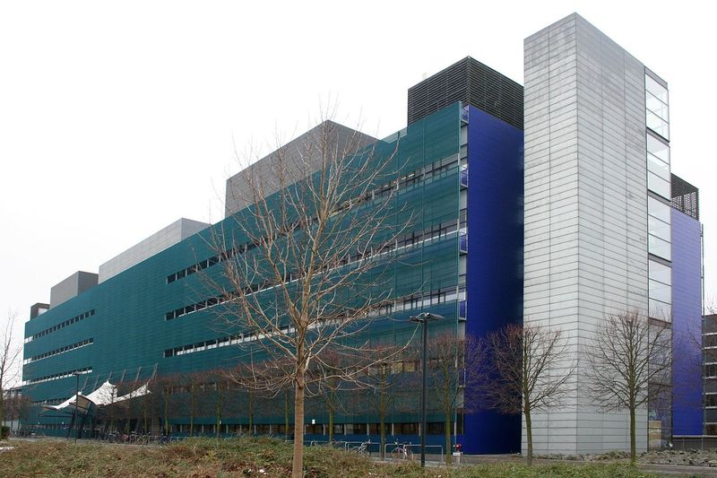

## Agenda 


1. `whoami` and Motivation
2. Performance outside-in
3. Performance inside-out
4. Benchmarks and how to create them


# whoami and Motivation


## Disclaimer


.container-fluid[

.row justify-content-center[

  .col[

{ class="figure-img img-fluid" width="40%" }  

**[github.com/psteinb/meetingcpp2017](https://github.com/psteinb/meetingcpp2017)**


  .]

.]

.]


:notes[

report bugs and questions there!

:]


## `whoami`

.container-fluid[

.row align-items-center[

.col[

{ class="figure-img img-fluid" width="50%" }

.]

.col[

**[Scionics Computer Innovation GmbH](www.scionics.de)**

- software and consulting company
- founded in 2001 in Dresden, Germany
- expertise in data analysis, bioinformatics, image analysis, HPC, ...

.]

.]

.]


:notes[

- 2h by car south of Berlin  
- NEXT: biggest client = CBG

:]


## Our Client


.container-fluid[

.row align-items-center[

.col[

{ class="figure-img img-fluid" width="100%" }

[mpi-cbg.de](www.mpi-cbg.de)

.]

.col[

- 500+ staff
- my role: *Scientific Software Engineer*
- support users on our HPC infrastructure
- software projects related to performance (think multi-threaded, GPUs, ..)

.]

.]

.]


:notes[

- biggest client
- NEXT: How does my day look like sometimes ...

:]


# Performance Outside-In


## One day as a Performance Engineer

, CC](img/flickr_ORourke_2_busy_to_improve_1200px.png){ class="figure-img img-fluid" width="70%" }

:notes[

- scientists typically develop algorithms (to publish)
- performance is important for usablity

:]

## Once in a while { data-background-image="img/frustration-cry-1682140_1920.jpg" }

.container[

.row align-items-center[

.col[

```
From: doe@theinstitute.de
Subject: Cluster is slow
Date: Fri, 20 Oct 2017 12:03:21 +0200
To: hpcsupport@theinstitute.de

Hi,

what is going on with the cluster? My application is running
slow since yesterday.
Could you have a look at it please?

Thanks,
John
```

.]

.]

.]


:notes[

- speed is a subjective measure
- performance is a matter of perspective
- note: description for reproducibility missing
- https://youtu.be/FnGCDLhaxKU?t=6152

:]


## Challenge: Find the cause of the performance regression without looking at the code {  data-background-image="img/binary-958952_1920_greybackground.jpg" }


## High Level Overview


.container-fluid[

.row align-items-center[

.col[

, [free](https://linux.die.net/man/1/free) et al](img/htop_in_action.png){ class="figure-img img-fluid" width="90%" }

.]

.col[

 courtesy of Fergie4000, CC-BY 3.0](img/Win7-tskman-perf.png){ class="figure-img img-fluid" width="80%" }

.]

.]

.]


## Reference Numbers

```
$ dd if=/dev/zero of=/tmp/just_zeros bs=1G count=2
2+0 records in
2+0 records out
2147483648 bytes (2.1 GB) copied, 2.94478 s, 729 MB/s

$ dd if=/dev/zero of=/dev/shm/steinbac.zeros bs=1G count=2
2+0 records in
2+0 records out
2147483648 bytes (2.1 GB) copied, 1.14782 s, 1.9 GB/s
```

&nbsp;

**What can your hardware typically do?**  

`dd`, `iperf`, `memhog`, ...


:notes[

- to search for the bottleneck, know your performance

]


## Profile with [perf](https://perf.wiki.kernel.org/index.php/Main_Page)

.container-fluid[

.row align-items-center[

  .col-8[


```
$ perf record -g ./my-slow-binary
[ perf record: Woken up 1 times to write data ]
[ perf record: Captured and wrote 0.023 MB perf.data (75 samples) ]
$ perf report --stdio
no symbols found in /usr/bin/dd, maybe install a debug package?
# ...
# Total Lost Samples: 0
#
# Samples: 75  of event 'cycles:u'
# Event count (approx.): 1839654
#
# Children      Self  Command  Shared Object      Symbol           
# ........  ........  .......  .................  ................
#
    20.18%    20.18%  dd       [kernel.kallsyms]  [k] page_fault
            |          
             --19.77%--0
                       _int_realloc
                       page_fault

```

  .]

  .col-4[

  - instrument CPU performance counters, tracepoints and system probes
  - lightweight sample based profiling 
  - per task, per CPU and per-workload counters
  - on windows: [xperf](https://docs.microsoft.com/en-us/windows-hardware/test/wpt/wpt-getting-started-portal)
  
  .]

.]

.]


## [perf](https://perf.wiki.kernel.org/index.php/Main_Page) Reloaded with [FlameGraphs](https://github.com/brendangregg/FlameGraph)


.container-fluid[

.row align-items-center[

  .col-8[


```
$ perf record -g ./my-slow-binary
[ perf record: Woken up 1 times to write data ]
[ perf record: Captured and wrote 0.023 MB perf.data (75 samples) ]
$ perf script > out.perf
$ ./stackcollapse-perf.pl out.perf > out.folded
$ ./flamegraph.pl out.folded > perf_samples.svg
```

  .]

  .col-4[

  - visualisation technique conceived by [Brendan Gregg](https://github.com/brendangregg) (Netflix)
  - seemless integration into perf, dtrace, systemtap, XCode Instruments, Lightweight Java Profiler, Microsoft Visual Studio profiles, ...
  - based on collected perf samples and the stacktrace they were collected in
  
  .]

.]

.]


## Starting Java as FlameGraph

.container-fluid[

.row align-items-center[

  .col-8[
  
  { class="figure-img img-fluid" }

  .]

  .col-4[

  - (x axis) current stack level in alphabetical order  
  
  - (y axis) number of samples in that stacktrace level
  
  .]

.]

.]


:notes[

- overwhelming at first


:]
